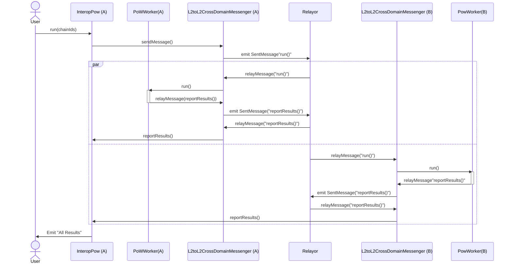

# Interop Proof of Work
Parallel computation on the superchain. 

## What?
The idea is that there is a coordination contract InteropPow on chain A which the user interacts with directly, and an instance of PowWorker on multiple chains (here just two chains A and B). When the user calls InteropPow, the x-domain messaging system is invoked to trigger PowWorker to mine some nonces (or “results”). The PowWorker then sends the results as concatenated 8 byte strings back to the InteropPow.

 



## Why?

You could load balance your computation across the superchain gas markets. As in, route your computational work to where gas is cheap. You can also get `N` fold speedup, where `N` is the number of chains, for appropriately parallelizable computations. 

## Example output
You need a private key in a `.env` file funded on chain 0 of the interop devnet. 
```
npx ts-node script.ts
```

output:
```
 interop-pow git:(gk/init) ✗ npx ts-node script.ts
⚖️ User balance is  0.899979915965011963 on chain 0
⚖️ Relayor balance is  0.099997872652836462 on chain 0
⚖️ Relayor balance is  0.100994849691212438 on chain 1
🧂 CREATE2 deployment salt: 0x5f49333E8433A8fF9CdbD83Cf10184f20D8FDf65000000000000000000000000
📜 interopPoW already deployed to  0x477142f6D5a705BC02E86132EF1E801b44959336  on chain 0
📜 worker already deployed to  0x80A494f0142A980b0BB5Ef63B6f1cecB16579621 on chain 0
📜 worker already deployed to  0x80A494f0142A980b0BB5Ef63B6f1cecB16579621  on chain 1
🗳️ interopPoW.run() tx launching with hash 0x0ecdf436961d75b23ce5662a0817a2debe69f8d0885fa9ad39c300d1c03905fb
⚒️ tx confirmed
🗣️ polling for state every 500 ms...

Querying results... 0 ms
worker0 (LOCAL) cached results have length: 320
worker1 (REMOTE) cached results have length: 128
InteropPoW.allResults has length: 320

Querying results... 1000 ms
worker0 (LOCAL) cached results have length: 320
worker1 (REMOTE) cached results have length: 128
InteropPoW.allResults has length: 320

Querying results... 2000 ms
worker0 (LOCAL) cached results have length: 320
worker1 (REMOTE) cached results have length: 192
InteropPoW.allResults has length: 320

Querying results... 3000 ms
worker0 (LOCAL) cached results have length: 320
worker1 (REMOTE) cached results have length: 192
InteropPoW.allResults has length: 512
```

You can see we get the local results within one block.
The remote results come back within a couple of seconds. 


https://github.com/user-attachments/assets/957d81dd-4d55-46b2-9e77-e422c76eab13

