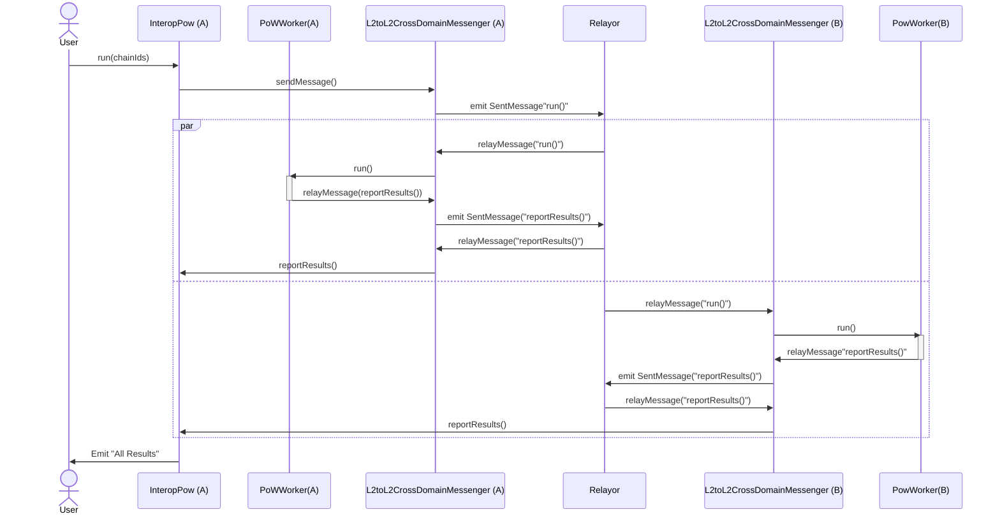

# Interop Proof of Work
Parallel computation on the superchain. 

## What?
The idea is that there is a coordination contract InteropPow on chain A which the user interacts with directly, and an instance of PowWorker on multiple chains (here just two chains A and B). When the user calls InteropPow, the x-domain messaging system is invoked to trigger PowWorker to mine some nonces (or “results”). The PowWorker then sends the results as concatenated 8 byte strings back to the InteropPow.

 

## Why?

You could load balance your computation across the superchain gas markets. As in, route your computational work to where gas is cheap. You can also get `N` fold speedup, where `N` is the number of chains, for appropriately parallelizable computations. 
